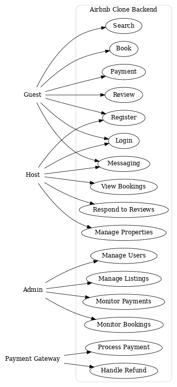

# Use Case Diagram - Airbnb Clone

## Objective
This use case diagram visualizes how different actors (users, hosts, admins, and payment systems) interact with the Airbnb Clone backend.

## Actors
- **Guest**: Registers, logs in, searches properties, books, makes payments, leaves reviews, and sends/receives messages.
- **Host**: Registers, logs in, manages property listings, views bookings, responds to reviews, and sends/receives messages.
- **Admin**: Manages users, listings, bookings, and payments.
- **Payment Gateway**: Processes payments and handles refunds.

## Key Use Cases
- User Authentication (registration, login)
- Property Management (create, update, delete)
- Search and Filtering
- Booking Management
- Payment Processing
- Reviews and Ratings
- Notifications
- Admin Monitoring

## Diagram
